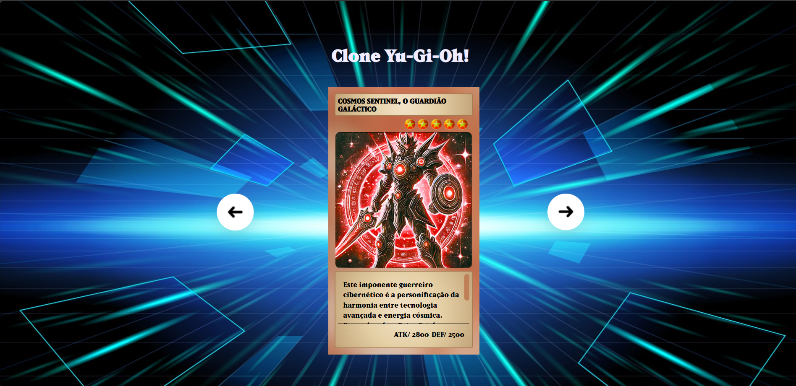

# 🃏 Clone do Jogo Yu-Gi-Oh!

# Yu-Gi-Oh!

Um simples jogo de cartas inspirado no universo de Yu-Gi-Oh!, desenvolvido com tecnologias web front-end.

## 🎮 Sobre o Jogo

Este é um clone simplificado do famoso jogo de cartas Yu-Gi-Oh!. O objetivo é criar uma experiência de duelo de jogador contra computador, utilizando cartas com diferentes atributos de ataque e defesa.

> **Screenshot do Jogo**
> 
> 

## ✨ Funcionalidades

-   **Duelo Player vs. Machine:** Enfrente o computador em um duelo de cartas.
-   **Sistema de Pontuação:** Acompanhe os pontos de vida de ambos os jogadores.
-   **Seleção de Cartas:** Escolha uma carta para batalhar a cada rodada.
-   **Efeitos Sonoros:** Áudios que tornam a experiência mais imersiva.
-   **Interface Intuitiva:** Design inspirado no jogo original.

## 🛠️ Tecnologias Utilizadas

O projeto foi construído utilizando as seguintes tecnologias:

-   **HTML5:** Para a estrutura semântica da página.
-   **CSS3:** Para a estilização, layout e animações.
-   **JavaScript:** Para toda a lógica e interatividade do jogo.

## 🚀 Como Executar o Projeto

Para rodar este projeto localmente, você só precisa de um navegador web. Siga os passos abaixo:

1.  **Clone o repositório:**
    ```bash
    git clone https://github.com/evelynnnie/projeto-clone-yu-gi-oh.git
    ```

2.  **Navegue até o diretório do projeto:**
    ```bash
    cd projeto-clone-yu-gi-oh
    ```

3.  **Abra o arquivo `index.html` no seu navegador:**
    Você pode simplesmente clicar duas vezes no arquivo `index.html` ou abri-lo através do seu editor de código com uma extensão como o "Live Server" (VS Code).

E pronto! O jogo estará rodando no seu navegador.

## 📂 Estrutura de Arquivos

O projeto está organizado da seguinte forma para facilitar a manutenção:

```
projeto-clone-yu-gi-oh/
├──docs
├── src/
│   ├── assets/           # Contém todos os recursos (imagens, áudios, etc.)
│   ├── scripts/
│   │   └── engine.js     # Lógica principal do jogo
│   └── styles/           # Arquivos de estilização CSS
├── index.html            # Arquivo principal da aplicação
└── README.md             # Este arquivo
```

## ✒️ Autor

Este projeto foi desenvolvido por **Daiane Araujo**.

-   **GitHub:** @evelynnnie